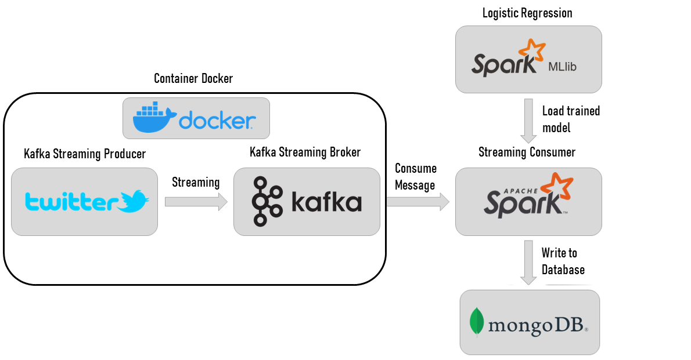
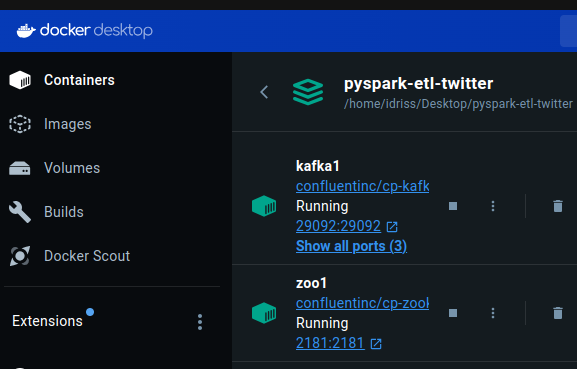
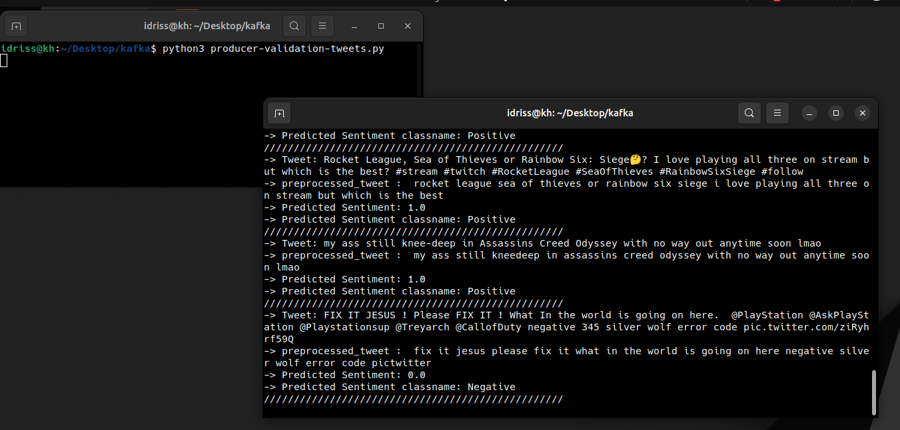
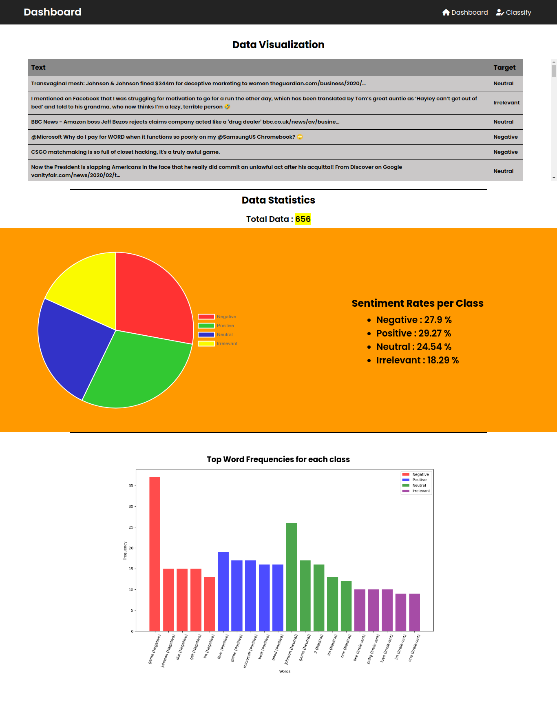
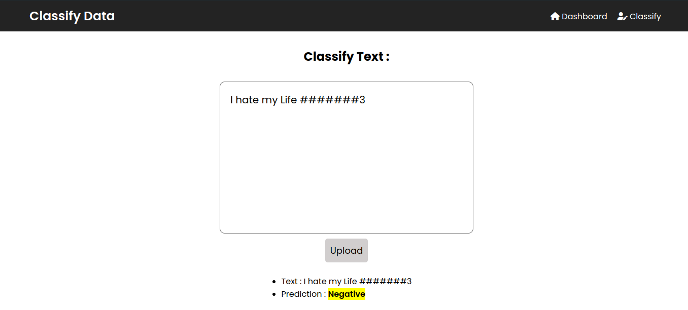

# Big Data Project: Real-Time Twitter Sentiment Analysis

## Overview

This repository contains a Big Data project focused on real-time sentiment analysis of Twitter data. The project leverages various technologies to collect, process, analyze, and visualize sentiment data from tweets in real-time.

## Project Architecture

The project is built using the following components:

- **Apache Kafka**: Used for real-time data ingestion from Twitter DataSet.
- **Spark Streaming**: Processes the streaming data from Kafka to perform sentiment analysis.
- **MongoDB**: Stores the processed sentiment data.
- **Django**: Serves as the web framework for building a real-time dashboard to visualize the sentiment analysis results.

- This is the project plan :
   

## Features

- **Real-time Data Ingestion**: Collects live tweets using Kafka from the Twitter DataSet.
- **Stream Processing**: Utilizes Spark Streaming to process and analyze the data in real-time.
- **Sentiment Analysis**: Classifies tweets into different sentiment categories (positive, negative, neutral) using natural language processing (NLP) techniques.
- **Data Storage**: Stores the sentiment analysis results in MongoDB for persistence.
- **Visualization**: Provides a real-time dashboard built with Django to visualize the sentiment trends and insights.

## Data description:

In This Project I'm using a Dataset (twitter_training.csv and twitter_validation.csv) to create pyspark Model and for create live tweets using Kafka. Each line of the "twitter_training.csv" learning database represents a Tweet, it contains over 74682 lines;

The data types of Features are:
- Tweet ID: int
- Entity: string
- Sentiment: string (Target)
- Tweet content: string

The validation database “twitter_validation.csv” contains 998 lines (Tweets) with the same features of “twitter_training.csv”.

This is the Data Source:
https://www.kaggle.com/datasets/jp797498e/twitter-entity-sentiment-analysis

## Repository Structure

- **Django-Dashboard** : this folder contains Dashboard Django Application
- **Kafka-PySpark** : this folder contains kafka provider and pyspark streaming (kafka consumer).
- **zk-single-kafka-single.yml** : Download and install Apache Kafka in docker.
- **bigdataproject rapport** : a brief report about the project (in french).

## Getting Started

### Prerequisites

To run this project, you will need the following installed on your system:

- Docker (for runing Kafka)
- Python 3.x
- Apache Kafka
- Apache Spark (PySpark for python)
- MongoDB
- Django

### Installation

1. **Clone the repository**:
   ```bash
   git clone https://github.com/drisskhattabi6/Real-Time-Twitter-Sentiment-Analysis.git
   cd big-data-project
   ```
   
2. **Installing Docker Desktop**

3. **Set up Kafka**:
   - Download and install Apache Kafka in docker using :
   ```bash
   docker-compose -f zk-single-kafka-single.yml up -d
   ```

5. **Set up MongoDB**:
   - Download and install MongoDB.
   - Start the MongoDB server.
     - It is recommended to install also **MongoDBCompass** to visualize data and makes working with mongodb easier.

6. **Install Python dependencies**:
   - To install pySpark - PyMongo - Django ...
   ```bash
   pip install -r requirements.txt
   ```

### Running the Project

   Note : you will need MongoDB for Running the Kafka and Spark Streaming application and for Running Django Dashboard application.
-> **Start MongoDB**:
   - using command line :
   ```bash
   mongod
   ```
   - or using **MongoDBCompass** (Recommended).

#### Running the Kafka and Spark Streaming application :

1. **Change the directory to the application**:
   ```bash
   cd Kafka-PySpark
   ```

2. **Start Kafka in docker**:
   - using command line :
   ```bash
   docker exec -it kafka1 /bin/bash
   ```
   - using docker desktop :
     
     

4. **Run kafka Zookeeper and a Broker**:
   ```bash
   kafka-topics --create --topic twitter --bootstrap-server localhost:9092
   kafka-topics --describe --topic twitter --bootstrap-server localhost:9092
   ```

5. **Run kafka provider app**:
   ```bash
   py producer-validation-tweets.py
   ```

6. **Run pyspark streaming (kafka consumer) app**:
   ```bash
   py consumer-pyspark.py
   ```



this is an img of the MongoDBCompass after Running the Kafka and Spark Streaming application :


#### Running Django Dashboard application :

1. **Change the directory to the application**:
   ```bash
   cd Django-Dashboard
   ```

2. **Creating static folder**:
   ```bash
   python manage.py collectstatic
   ```

3. **Run the Django server**:
   ```bash
   python manage.py runserver
   ```

4. **Access the Dashboard**:
   Open your web browser and go to `http://127.0.0.1:8000` to view the real-time sentiment analysis dashboard.





## More informations : 

- Django Dashboard get the data from MongoDb DataBase.
- the User can classify his owne text in `http://127.0.0.1:8000/classify` link.
- in the Dashboard, There is a table contains tweets with labels.
- in the Dashboard, There is 3 statistics or plots : labels rates - pie plot - bar plot.
  
---

By following the above instructions, you should be able to set up and run the real-time Twitter sentiment analysis project on your local machine. Happy coding!
